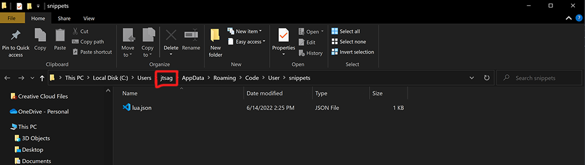
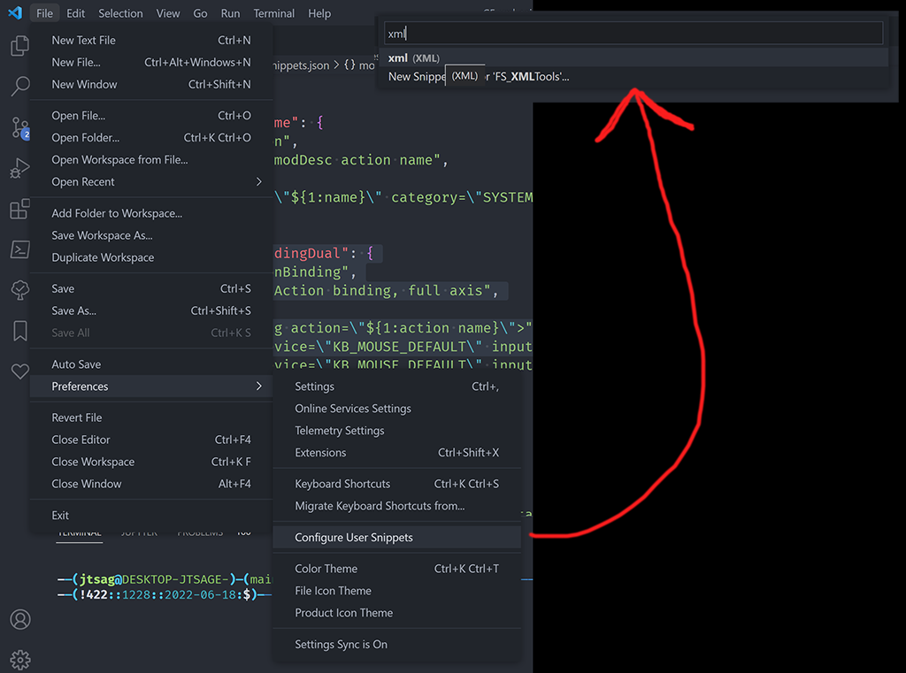

# Giants XML Snippets for vsCode

This is a snippets file that contains some of the most used XML elements from the Giants spec.  It has both modDesc and storeItem snippets.

## Installing - Direct Copy

1.) Download `Giants_XML_Snippets.json` and rename the file to `xml.json`

2.) Place it in `%appdata%\Code\User\snippets`

## Installing - Edit or Create Existing JSON file

1.) Download `GIANTS_XML_Snippets.json`

2.) In vsCode, go to `File->Preferences->Configure User Snippets`

3.) Choose "XML" (by clicking or typing)

4.) Paste the contents of `GIANTS_XML_Snippets.json` into the `xml.json` file that opens

## LICENSE

This script is licensed under the MIT license, as such, you can do whatever you like to it, so long as attribution is given to the original author
